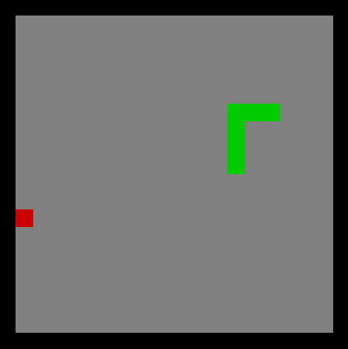

# RustySnake

Just a simple multiplatform snake made in Rust.

## Play it

    $ https://github.com/AxelBrinck/RustySnake.git
    $ cd RustySnake
    $ cargo run

_Ensure [Git](https://git-scm.com/downloads) and [Rust](https://www.rust-lang.org/) is installed before executing the commands._